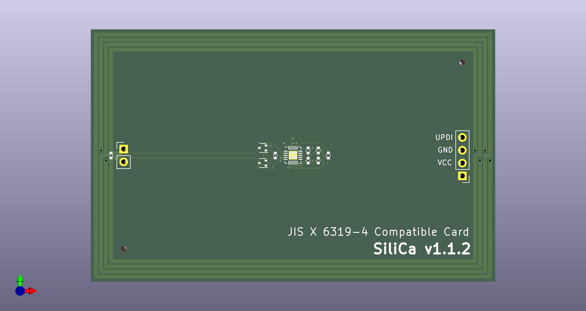
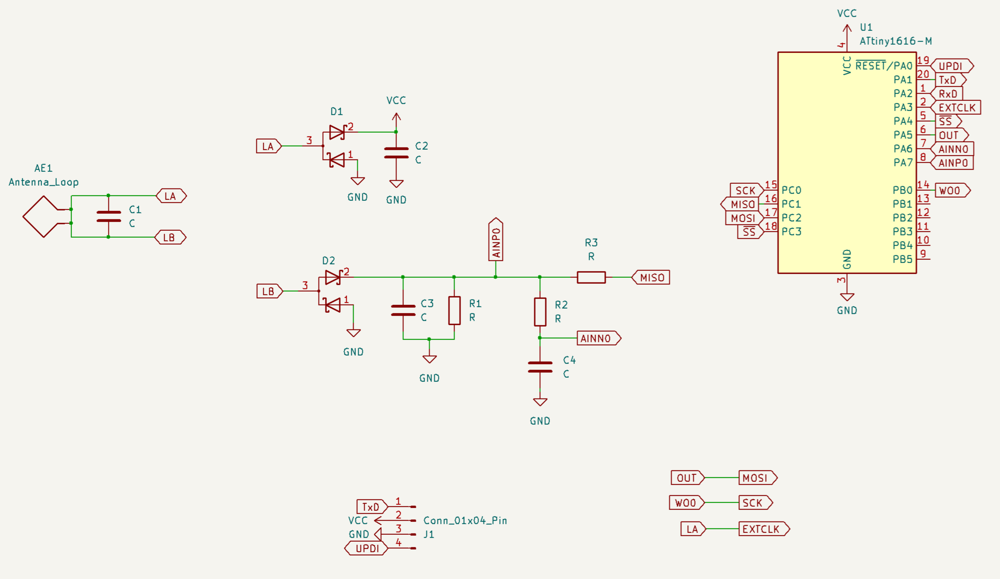

# SiliCa

`SiliCa` は JIS X 6319-4（`FeliCa`）互換の非接触 IC カードです。  
マイコンには `ATtiny1616` を使用し、外部電源なしでカードリーダから給電して動作します。

## 概要

`SiliCa` は最小限のハードウェアで `FeliCa` プロトコルをファームウェアで再現し、`FeliCa Standard` や `FeliCa Lite-S` のエミュレーションを目的とします。

また、実際の `FeliCa` カードでは書き換えが不可能な `IDm` やシステムコードなどのパラメータも、`SiliCa` では書き換えることが可能です。

設計手順や使用方法の詳細については、寄稿した同人誌 [rand_r(&v3)](https://example.com) をご参照ください。

## 回路図

## ライセンス

このプロジェクトは [The Unlicense](https://unlicense.org/) に基づき公開されています。  
これにより、このリポジトリの内容はパブリックドメインとして公開され、どなたでも自由に利用、改変、再配布することが可能です。

## 連絡先

ご質問やご連絡がある場合は、以下のメールアドレスまでお願いいたします。  
19aj137@proton.me

## 注意事項

本プロジェクトは学術・実験目的であり、商用利用や実運用を目的としたものではありません。

また、各種知的財産権を侵害する意図はなく、知的財産権の無侵害を保証するものでもありません。

FeliCa は、ソニー株式会社が開発した非接触 IC カードの技術方式です。

FeliCa は、ソニーグループ株式会社の登録商標です。

本文では ™、® は明記していません。
